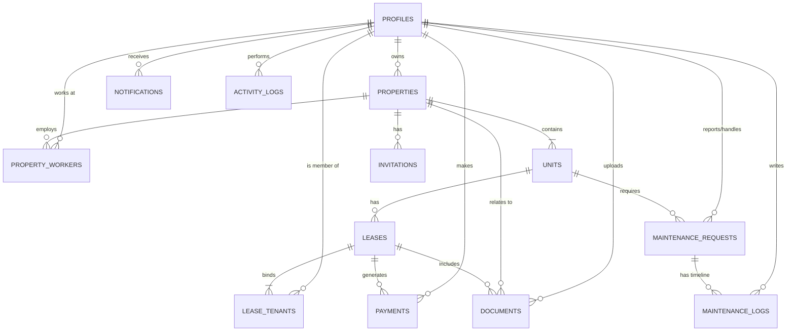

# PropEase — Application Overview

> **PropEase** is a full-stack, production-ready property management platform built for independent landlords, property managers, maintenance staff, and tenants. It consolidates buildings, units, leases, rent collection, maintenance operations, document management, and real-time notifications into a single, cohesive workspace — deployed on Cloudflare's edge network.

---

## Table of Contents

- [At a Glance](#at-a-glance)
- [Technology Stack](#technology-stack)
- [Architecture](#architecture)
- [User Roles & Access Control](#user-roles--access-control)
- [Feature Breakdown](#feature-breakdown)
  - [Authentication & Onboarding](#1-authentication--onboarding)
  - [Property & Unit Management](#2-property--unit-management)
  - [Tenant CRM & Lease Lifecycle](#3-tenant-crm--lease-lifecycle)
  - [Rent Collection & Financial Ledger](#4-rent-collection--financial-ledger)
  - [Maintenance Operations (Kanban)](#5-maintenance-operations-kanban)
  - [Document Management](#6-document-management)
  - [Notifications & Email Dispatcher](#7-notifications--email-dispatcher)
  - [Analytics Dashboard](#8-analytics-dashboard)
- [Database Schema Overview](#database-schema-overview)
- [Project Structure](#project-structure)
- [Deployment & Infrastructure](#deployment--infrastructure)
- [Environment Variables](#environment-variables)

---

## At a Glance

| Dimension          | Details                                                                           |
| :----------------- | :-------------------------------------------------------------------------------- |
| **Type**           | Full-stack SaaS-style web application                                             |
| **Target Users**   | Independent landlords, property managers, maintenance workers, tenants            |
| **Frontend**       | React 19 + TanStack Router + TanStack Start (SSR) + Radix UI + Tailwind CSS v4   |
| **Backend**        | TanStack Start server functions (edge-side RPC) running on Cloudflare Workers     |
| **Database**       | Cloudflare D1 (SQLite-compatible) with Drizzle ORM                                |
| **File Storage**   | Cloudflare R2 (S3-compatible object storage)                                      |
| **Payments**       | Stripe Checkout (live integration)                                                |
| **Auth**           | Custom JWT sessions + Google OAuth 2.0 + Email OTP verification                   |
| **Email**          | Multi-provider: Brevo (primary) → Resend (fallback) → Dev console (local)         |
| **Production URL** | `https://propease.rach-dev0731.workers.dev`                                       |

---

## Technology Stack

### Frontend
- **React 19** — UI library with concurrent features
- **TanStack Router** — Type-safe, file-based routing with loaders and search params
- **TanStack Start** — Full-stack SSR framework with server functions
- **Radix UI** — Accessible, unstyled component primitives (46 UI components)
- **Tailwind CSS v4** — Utility-first CSS framework
- **Recharts** — Composable charting library (area charts, pie/donut charts)
- **Lucide React** — Icon library
- **React Hook Form + Zod** — Form handling with schema validation
- **Sonner** — Toast notification system
- **date-fns** — Date manipulation utilities
- **Embla Carousel** — Carousel/slider component
- **cmdk** — Command palette component

### Backend & Infrastructure
- **Cloudflare Workers** — Serverless edge compute runtime
- **Cloudflare D1** — Distributed SQLite database
- **Cloudflare R2** — Object storage for document uploads
- **Drizzle ORM** — Type-safe SQL ORM with migration support
- **Stripe SDK** — Payment processing
- **AsyncLocalStorage** — Request-scoped environment binding propagation

### Build & Dev Tooling
- **Vite 7** — Build tool and dev server
- **Bun** — JavaScript runtime and package manager
- **Wrangler** — Cloudflare CLI for local development and deployment
- **TypeScript 5.8** — Strict type checking across the entire codebase
- **ESLint + Prettier** — Code quality and formatting

---

## Architecture

PropEase follows a **server-side rendered (SSR), edge-first** architecture:

```
┌─────────────────────────────────────────────────────┐
│                    Client (Browser)                  │
│  React 19 + TanStack Router + Radix UI + Tailwind   │
└────────────────────────┬────────────────────────────┘
                         │  RPC (Server Functions)
┌────────────────────────▼────────────────────────────┐
│             Cloudflare Workers (Edge)                │
│   TanStack Start Server Entry (src/server.ts)        │
│   ┌────────────────────────────────────────────┐     │
│   │  AsyncLocalStorage (request-scoped env)    │     │
│   │  ┌──────────┐ ┌───────────┐ ┌───────────┐ │     │
│   │  │ Auth     │ │ Data      │ │ Documents │ │     │
│   │  │ Server   │ │ Server    │ │ Server    │ │     │
│   │  └─────┬────┘ └─────┬─────┘ └─────┬─────┘ │     │
│   │        │             │             │       │     │
│   │  ┌─────▼─────────────▼─────────────▼─────┐ │     │
│   │  │       Drizzle ORM (queries.ts)        │ │     │
│   │  └───────────────┬───────────────────────┘ │     │
│   └──────────────────┼────────────────────────┘     │
│                      │                               │
│         ┌────────────▼────────────┐                  │
│         │   Cloudflare D1 (SQLite) │                 │
│         └─────────────────────────┘                  │
│         ┌─────────────────────────┐                  │
│         │   Cloudflare R2 (Files) │                  │
│         └─────────────────────────┘                  │
└─────────────────────────────────────────────────────┘
          │                         │
   ┌──────▼──────┐          ┌──────▼──────┐
   │   Stripe    │          │ Google OAuth │
   │   Checkout  │          │   2.0       │
   └─────────────┘          └─────────────┘
          │
   ┌──────▼──────┐
   │ Brevo/Resend│
   │ Email APIs  │
   └─────────────┘
```

**Key Architectural Decisions:**
- **Edge-native**: All server logic runs on Cloudflare Workers at the edge, minimizing latency globally.
- **Request-scoped bindings**: A custom `AsyncLocalStorage` container propagates Cloudflare environment bindings (D1, R2, secrets) through the request lifecycle — solving the Workers environment isolation challenge.
- **No separate API server**: Server functions (RPC) from TanStack Start eliminate the need for a separate REST/GraphQL backend.
- **Currency in cents**: All monetary values are stored as integers in cents to prevent floating-point rounding errors.
- **UUID v4 primary keys**: All entities use universally unique identifiers.

---

## User Roles & Access Control

PropEase implements a strict role-based access control (RBAC) system with **six user roles**, each granting a different view and permission set:

| Role            | Portal      | Capabilities                                                                                     |
| :-------------- | :---------- | :----------------------------------------------------------------------------------------------- |
| **Landlord**    | Admin       | Full access: properties, units, tenants, payments, maintenance, documents, analytics, settings   |
| **Manager**     | Admin       | All except billing settings; can manage properties, tenants, maintenance, and documents           |
| **Maintenance** | Admin (limited) | View and update assigned maintenance requests only; cannot resolve (only "Pending Approval")  |
| **Service**     | Admin (limited) | Same as Maintenance — external vendor/contractor role                                         |
| **Tenant**      | Tenant      | View own dashboard, pay rent, submit maintenance requests, upload/view documents, notifications  |
| **Admin**       | Admin       | System-level superuser (reserved)                                                                |

**Access enforcement** is implemented at two layers:
1. **Route-level** — TanStack Router loaders verify JWT sessions before serving any page
2. **Server function-level** — Every RPC handler calls `requireAuth()` and checks `session.role` before executing business logic

---

## Feature Breakdown

### 1. Authentication & Onboarding

**Sign-up Flow (Email + Password):**
- Users select a role during registration (Landlord, Manager, Maintenance, or Tenant via invite)
- Email restricted to `@gmail.com` addresses
- A 6-digit OTP is generated, stored in the `verification_codes` table (expires in 15 minutes), and delivered via email (or printed to the dev console locally)
- After OTP verification, the profile is created and a JWT session cookie (`propease_session`) is set
- In local development, a universal bypass code `"000000"` is available

**Google OAuth 2.0:**
- Full OAuth consent flow with CSRF state verification
- Automatic profile provisioning for new Google users
- JWT ID Token decoding for user identity extraction
- Base64Url padding fix for Cloudflare Workers runtime compatibility

**Invitation-Based Onboarding:**
- Landlords generate invitation links (`/auth?invite=[token]`) for tenants and maintenance workers
- Invited users land on the auth page with pre-populated email and role-locked sign-up
- If the invited email already exists in the system, the auth page defaults to "Sign In"
- Accepted invitations automatically: activate the lease, link tenant to unit, mark unit as "occupied", and generate initial invoices

**Session Management:**
- JWT tokens signed with HMAC-SHA256, valid for 7 days
- HTTP-only, secure, SameSite=Lax cookies
- Dynamic `JWT_SECRET` resolution from Cloudflare environment bindings

---

### 2. Property & Unit Management

**Properties:**
- Landlords can create multiple properties (buildings) with name, address, description, and optional geolocation (latitude/longitude)
- A **property switcher** dropdown in the admin sidebar enables quick context switching between buildings

**Units:**
- Each property contains one or more units with attributes: unit number, market rent (in cents), square footage, beds, baths, occupant limit, and amenities (JSON array)
- Unit statuses: `vacant`, `occupied`, `maintenance`
- **Create, edit, and manage** units through the admin properties page
- Unit status automatically propagates based on lease and maintenance state:
  - Lease activation → `occupied`
  - Maintenance request in progress → `maintenance`
  - Maintenance resolved + active lease → `occupied`
  - Maintenance resolved + no active lease → `vacant`

---

### 3. Tenant CRM & Lease Lifecycle

**Tenant Management:**
- View all tenants across properties with profiles, contact info, and lease details
- Send onboarding invitations with pre-configured lease terms (unit, rent amount, start/end dates)
- Tenant profiles include full name, email, phone, and avatar

**Lease Lifecycle:**
- Statuses: `draft` → `active` → `expired` / `terminated`
- **Auto-expiry**: System automatically marks leases as `expired` once their end date passes
- **Lease renewal**: Landlords can renew active leases with new end dates and rent amounts (creates a new lease, preventing premature expiration of the current one)
- **Lease termination**: Landlords/managers can terminate leases early
- **Multi-tenant support**: The `lease_tenants` junction table supports multiple occupants per lease (e.g., roommates) with a `is_primary` flag

---

### 4. Rent Collection & Financial Ledger

**Invoice Generation:**
- Landlords trigger monthly rent invoice creation for all active leases
- Invoices are only generated for leases that have started (no future-dated generation)
- Payment categories: `rent`, `deposit`, `utility`, `late_fee`
- Payment statuses: `pending`, `paid`, `late`, `failed`

**Stripe Checkout Integration:**
- Tenants initiate payments through Stripe Checkout sessions
- Dynamic redirect URLs (localhost-aware for development)
- Payment verification via Stripe session retrieval on redirect callback
- Transaction IDs stored in the payments table for audit trails

**Sandbox Card Testing:**
- Success card: `4242 4242 4242 4242`
- Decline card: `4000 0000 0000 3220` (triggers client-side error handling)

**Manual Payments:**
- Landlords can log physical payments (Cash, Check, Direct Deposit)
- Generates payment records and sends receipt emails to tenants

**Receipt System:**
- Both landlord and tenant portals include receipt modals with transaction details
- Browser-native print support for physical receipt generation

---

### 5. Maintenance Operations (Kanban)

**Request Lifecycle:**
- Tenants submit requests with title, description, and priority (`low`, `medium`, `high`, `emergency`)
- Statuses: `pending` → `in_progress` → `resolved_pending` → `resolved`

**Interactive Kanban Board:**
- Drag-and-drop status transitions for landlords and workers
- **Validation rules:**
  - Cannot move out of "Open" (pending) without an assigned worker
  - Workers can move to `in_progress` or `resolved_pending` but **cannot** set `resolved` (only landlords/managers can)
  - No backward regression from `in_progress` → `pending`

**Worker Assignment:**
- Only users with role `maintenance` or `service` appear in the assignee dropdown
- Worker assignment filtered by property (via `property_workers` table)
- Assignment triggers email notifications to the worker

**Maintenance Logs:**
- Chronological communication thread per request
- `is_internal` flag allows staff-only notes invisible to tenants
- Both tenants and staff can add log entries (with role-appropriate restrictions)

**Unit Status Propagation:**
- Moving a request to `in_progress` → unit status becomes `maintenance`
- Resolving a request → unit reverts to `occupied` (if active lease) or `vacant`
- All status updates are wrapped in atomic database transactions

---

### 6. Document Management

**Upload & Storage:**
- Tenants upload documents (lease docs, ID proofs, income proofs, inspection reports) from their portal
- Files are stored as Base64-encoded payloads uploaded to **Cloudflare R2** with auto-generated storage keys
- MIME type detection for PDFs, images, Word documents, and plain text
- Maximum file size limited by Cloudflare Workers request limits

**Review Workflow:**
- Document statuses: `pending_review` → `approved` / `rejected`
- Landlords and managers review uploaded documents from the admin documents queue
- Status updates are persisted and visible to tenants

**Download & Access Control:**
- Tenants can only access their own documents
- Landlords can only access documents for properties they own
- Documents are retrieved from R2 and returned as Base64 for client-side download

---

### 7. Notifications & Email Dispatcher

**In-App Notifications:**
- Types: `payment`, `maintenance`, `announcement`
- Real-time notification bell with unread count badge
- Mark individual or all notifications as read
- **Broadcast announcements**: Landlords can send property-wide or portfolio-wide announcements to all tenants

**Transactional Email System:**
- **Multi-provider architecture** with automatic failover:
  1. **Brevo** (primary) — SMTP API at `/v3/smtp/email`
  2. **Resend** (fallback) — REST API
  3. **Dev console** (local) — Formatted ASCII email mock-ups printed to terminal

- **Email triggers:**
  - Sign-up OTP verification codes
  - Tenant invitation links with lease summaries
  - New maintenance request alerts (→ landlord)
  - Worker assignment notifications (→ worker)
  - Payment receipt confirmations (→ tenant and landlord)
  - Manual payment receipts (→ tenant)

---

### 8. Analytics Dashboard

**Landlord Dashboard (Admin Portal):**
- **KPI Cards**: Occupancy rate, rent collected, open requests count, total units
- **Revenue Area Chart**: 6-month time series of collected vs. pending rent (Recharts)
- **Unit Status Donut Chart**: Occupied / vacant / maintenance breakdown
- **Recent Activity Feed**: Chronological log of actions (payments, maintenance updates, unit changes) with relative timestamps
- **Expiring Leases**: Leases ending within 90 days with color-coded urgency badges
- **Empty state**: Guided onboarding prompt when no properties exist

**Tenant Dashboard:**
- Welcome card with unit label, lease end date, monthly rent, and next balance due
- Quick-action shortcut cards (Pay Rent, Submit Request, Documents, Notices)
- Recent payments history with status badges
- Active maintenance requests with status indicators

---

## Database Schema Overview

The database consists of **13 tables** organized into 7 logical groups:



| Group                       | Tables                                            |
| :-------------------------- | :------------------------------------------------ |
| Identity & Profiles         | `profiles`, `verification_codes`                  |
| Properties & Units          | `properties`, `units`                             |
| Leases & Tenancy            | `leases`, `lease_tenants`                         |
| Operations                  | `maintenance_requests`, `maintenance_logs`, `payments` |
| Communications & Auditing   | `notifications`, `activity_logs`                  |
| Document Management         | `documents`                                       |
| Onboarding & Staffing       | `invitations`, `property_workers`                 |

> Full column-level documentation available in [`database_schema.md`](./database_schema.md).

---

## Project Structure

```
PropEase/
├── docs/                          # Documentation
│   ├── Overview.md                # This file
│   ├── database_schema.md         # Detailed table/column docs
│   └── progress_summary.md        # Phase-level milestone tracker
├── drizzle/                       # Drizzle ORM migrations
│   └── migrations/                # SQL migration files
├── src/
│   ├── server.ts                  # Custom Cloudflare Workers entry point
│   ├── router.tsx                 # TanStack Router configuration
│   ├── routeTree.gen.ts           # Auto-generated route tree
│   ├── styles.css                 # Global styles and Tailwind config
│   ├── components/
│   │   ├── AppShell.tsx           # Shared layout shell (sidebar, header, nav)
│   │   ├── Logo.tsx               # Brand logo component
│   │   ├── ThemeToggle.tsx        # Dark/light mode toggle
│   │   ├── admin/
│   │   │   └── AdminShell.tsx     # Admin-specific shell variant
│   │   ├── tenant/
│   │   │   └── TenantShell.tsx    # Tenant-specific shell variant
│   │   └── ui/                    # 46 Radix-based UI primitives (shadcn/ui)
│   ├── db/
│   │   ├── schema.ts              # Drizzle table definitions (13 tables)
│   │   ├── queries.ts             # All database queries (~70KB of business logic)
│   │   └── index.ts               # Database connection factory
│   ├── hooks/
│   │   └── use-mobile.tsx         # Responsive breakpoint hook
│   ├── lib/
│   │   ├── auth-crypto.ts         # JWT signing/verification, password hashing
│   │   ├── auth-server.ts         # Sign-in, sign-up, OTP server functions
│   │   ├── cloudflare-env.ts      # AsyncLocalStorage env binding manager
│   │   ├── data-server.ts         # Core CRUD server functions (tenants, maintenance, payments)
│   │   ├── document-server.ts     # R2 document upload/download/review server functions
│   │   ├── email.ts               # Multi-provider email dispatcher
│   │   ├── mock-data.ts           # Static seed/demo data
│   │   ├── oauth-server.ts        # Google OAuth 2.0 flow
│   │   ├── property-server.ts     # Property/unit/invitation server functions
│   │   ├── stripe-server.ts       # Stripe Checkout session management
│   │   ├── theme.tsx              # Theme context provider
│   │   └── utils.ts               # Shared utilities (cn helper)
│   └── routes/
│       ├── __root.tsx             # Root layout (Toaster, meta tags)
│       ├── index.tsx              # Public landing page
│       ├── auth.tsx               # Authentication page (Sign-in/Sign-up/OTP)
│       ├── auth.oauth-callback.tsx # Google OAuth redirect handler
│       ├── admin.tsx              # Admin layout wrapper
│       ├── admin.index.tsx        # Admin dashboard (KPIs, charts, activity)
│       ├── admin.properties.tsx   # Property & unit management
│       ├── admin.tenants.tsx      # Tenant CRM & invitation system
│       ├── admin.payments.tsx     # Payment ledger & invoice generation
│       ├── admin.maintenance.tsx  # Maintenance Kanban board
│       ├── admin.documents.tsx    # Document review queue
│       ├── admin.notifications.tsx # Notification center & announcements
│       ├── admin.settings.tsx     # Account settings
│       ├── tenant.tsx             # Tenant layout wrapper
│       ├── tenant.index.tsx       # Tenant dashboard
│       ├── tenant.pay.tsx         # Rent payment (Stripe Checkout)
│       ├── tenant.maintenance.tsx # Maintenance request submission
│       ├── tenant.documents.tsx   # Document upload portal
│       └── tenant.notifications.tsx # Tenant notification feed
├── wrangler.jsonc                 # Cloudflare Workers/D1/R2 configuration
├── drizzle.config.ts              # Drizzle migration configuration
├── vite.config.ts                 # Vite build configuration
├── package.json                   # Dependencies and scripts
├── tsconfig.json                  # TypeScript configuration
└── progress_logs.md               # Detailed daily development logs
```

---

## Deployment & Infrastructure

| Component           | Service                  | Details                                              |
| :------------------ | :----------------------- | :--------------------------------------------------- |
| **Compute**         | Cloudflare Workers       | Edge-deployed serverless runtime                     |
| **Database**        | Cloudflare D1            | `propease-db` (SQLite, globally replicated)          |
| **File Storage**    | Cloudflare R2            | `propease-bucket` (S3-compatible, zero egress fees)  |
| **Payments**        | Stripe                   | Checkout Sessions API                                |
| **OAuth**           | Google Cloud Console     | OAuth 2.0 Client Credentials                        |
| **Email (Primary)** | Brevo                    | SMTP API (`/v3/smtp/email`)                          |
| **Email (Fallback)**| Resend                   | REST API                                             |

**Build & Deploy Commands:**
```bash
# Development
npm run dev              # Start local Vite + Wrangler dev server

# Database
npx wrangler d1 migrations apply propease-db --local     # Apply migrations locally
npx wrangler d1 migrations apply propease-db --remote    # Apply migrations to production

# Production
npm run build            # Build production bundle
npx wrangler deploy --config dist/server/wrangler.json   # Deploy to Cloudflare edge
```

---

## Environment Variables

Configured in `.dev.vars` (local) or Cloudflare dashboard (production):

| Variable              | Required | Description                                  |
| :-------------------- | :------- | :------------------------------------------- |
| `JWT_SECRET`          | ✅       | HMAC-SHA256 secret for session tokens         |
| `STRIPE_SECRET_KEY`   | ✅       | Stripe secret key (test or live)              |
| `GOOGLE_CLIENT_ID`    | ✅       | Google OAuth 2.0 client ID                    |
| `GOOGLE_CLIENT_SECRET`| ✅       | Google OAuth 2.0 client secret                |
| `BREVO_API_KEY`       | Optional | Brevo transactional email API key             |
| `BREVO_SENDER_EMAIL`  | Optional | Brevo sender email address                    |
| `BREVO_SENDER_NAME`   | Optional | Brevo sender display name                     |
| `RESEND_API_KEY`      | Optional | Resend email API key (fallback)               |
| `RESEND_FROM`         | Optional | Resend sender address                         |

> See [`.dev.vars.example`](../.dev.vars.example) for a template with all keys.
