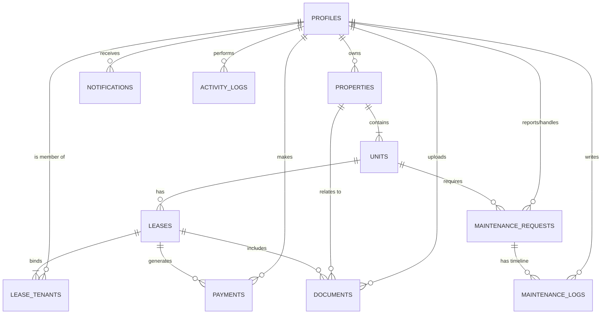

# PropEase Database Schema (v2)

This document serves as the official **Source of Truth** for the PropEase data architecture.

## Technical Standards

- **Database**: Cloudflare D1 (SQLite-compatible)
- **ORM**: Drizzle ORM
- **Currency**: All monetary values are stored as **Integers in Cents** (to prevent floating-point errors).
- **Primary Keys**: All IDs use **UUID v4**.
- **Timestamps**: Every table includes `created_at` and `updated_at`.

---

## 1. Identity & Profiles

### `profiles`

Stores core user information and role-based access levels.

| Column                 | Type    | Description                                                        |
| :--------------------- | :------ | :----------------------------------------------------------------- |
| `id`                   | UUID    | Primary Key (matches Auth Provider ID)                             |
| `email`                | String  | Unique user email                                                  |
| `first_name`           | String  | User first name                                                    |
| `last_name`            | String  | User last name                                                     |
| `middle_name`          | String  | Optional middle name                                               |
| `phone`                | String  | Contact number                                                     |
| `role`                 | Enum    | `landlord`, `tenant`, `admin`, `manager`, `maintenance`, `service` |
| `onboarding_completed` | Boolean | Flags if the user has finished role-specific setup                 |
| `avatar_url`           | String  | URL to profile image                                               |

---

## 2. Properties & Units

### `properties`

Buildings or portfolios owned by a Landlord.

| Column        | Type   | Description                    |
| :------------ | :----- | :----------------------------- |
| `id`          | UUID   | Primary Key                    |
| `landlord_id` | UUID   | FK to `profiles.id`            |
| `name`        | String | Marketing name of the property |
| `address`     | String | Full physical address          |
| `latitude`    | REAL   | Geolocation Latitude           |
| `longitude`   | REAL   | Geolocation Longitude          |
| `description` | Text   | Property details / amenities   |

### `units`

Specific spaces within a property.

| Column                | Type    | Description                                           |
| :-------------------- | :------ | :---------------------------------------------------- |
| `id`                  | UUID    | Primary Key                                           |
| `property_id`         | UUID    | FK to `properties.id`                                 |
| `unit_number`         | String  | e.g., "101", "Apt 4B"                                 |
| `status`              | Enum    | `vacant`, `occupied`, `maintenance`                   |
| `current_market_rent` | Integer | Target rent in cents                                  |
| `sqft`                | Integer | Square footage                                        |
| `beds`                | Integer | Number of bedrooms                                    |
| `baths`               | Integer | Number of bathrooms                                   |
| `occupants_limit`     | Integer | Max occupancy for this unit                           |
| `amenities`           | JSON    | Array of strings (e.g., `["Gym", "Pool", "Balcony"]`) |

---

## 3. Leases & Tenancy

### `leases`

The legal contract binding a unit to a billing period.

| Column             | Type    | Description                                |
| :----------------- | :------ | :----------------------------------------- |
| `id`               | UUID    | Primary Key                                |
| `unit_id`          | UUID    | FK to `units.id`                           |
| `start_date`       | Date    | Lease commencement                         |
| `end_date`         | Date    | Lease termination                          |
| `monthly_rent`     | Integer | Agreed rent in cents                       |
| `security_deposit` | Integer | Deposit amount in cents                    |
| `status`           | Enum    | `draft`, `active`, `expired`, `terminated` |

### `lease_tenants`

Junction table linking multiple people to a single lease (e.g., roommates).

| Column       | Type    | Description                     |
| :----------- | :------ | :------------------------------ |
| `lease_id`   | UUID    | FK to `leases.id`               |
| `profile_id` | UUID    | FK to `profiles.id`             |
| `is_primary` | Boolean | Flags the main point of contact |

---

## 4. Operations (Maintenance & Payments)

### `maintenance_requests`

Work orders reported by tenants or staff.

| Column               | Type   | Description                          |
| :------------------- | :----- | :----------------------------------- |
| `id`                 | UUID   | Primary Key                          |
| `unit_id`            | UUID   | FK to `units.id`                     |
| `tenant_id`          | UUID   | FK to `profiles.id` (Reporter)       |
| `assigned_worker_id` | UUID   | FK to `profiles.id` (Worker)         |
| `title`              | String | Brief summary of the issue           |
| `description`        | Text   | Detailed problem description         |
| `priority`           | Enum   | `low`, `medium`, `high`, `emergency` |
| `status`             | Enum   | `pending`, `in_progress`, `resolved` |

### `maintenance_logs`

Chronological communication or status updates for a specific request.

| Column        | Type    | Description                          |
| :------------ | :------ | :----------------------------------- |
| `id`          | UUID    | Primary Key                          |
| `request_id`  | UUID    | FK to `maintenance_requests.id`      |
| `author_id`   | UUID    | FK to `profiles.id`                  |
| `content`     | Text    | Message content or log entry         |
| `is_internal` | Boolean | If true, only staff can see this log |

### `payments`

Financial transactions related to a lease.

| Column           | Type    | Description                              |
| :--------------- | :------ | :--------------------------------------- |
| `id`             | UUID    | Primary Key                              |
| `lease_id`       | UUID    | FK to `leases.id`                        |
| `tenant_id`      | UUID    | FK to `profiles.id`                      |
| `amount`         | Integer | Amount in cents                          |
| `category`       | Enum    | `rent`, `deposit`, `utility`, `late_fee` |
| `due_date`       | Date    | Scheduled payment date                   |
| `paid_date`      | Date    | Actual payment date                      |
| `status`         | Enum    | `pending`, `paid`, `late`, `failed`      |
| `transaction_id` | String  | Stripe/External reference                |

---

## 5. System Communications & Auditing

### `notifications`

| Column         | Type      | Description                              |
| :------------- | :-------- | :--------------------------------------- |
| `id`           | UUID      | Primary Key                              |
| `recipient_id` | UUID      | FK to `profiles.id`                      |
| `type`         | Enum      | `payment`, `maintenance`, `announcement` |
| `title`        | String    | Alert title                              |
| `body`         | String    | Alert content                            |
| `is_read`      | Boolean   | Read/Unread status                       |
| `created_at`   | Timestamp | Time sent                                |

### `activity_logs` (Audit Trail)

| Column        | Type      | Description                                     |
| :------------ | :-------- | :---------------------------------------------- |
| `id`          | UUID      | Primary Key                                     |
| `actor_id`    | UUID      | FK to `profiles.id`                             |
| `action_type` | String    | e.g., `PAYMENT_RECEIVED`, `UNIT_STATUS_CHANGED` |
| `description` | String    | Human-readable log                              |
| `metadata`    | JSON      | Extra contextual data                           |
| `created_at`  | Timestamp | Time logged                                     |

---

## 6. Document Management

### `documents`

Secure file storage metadata.

| Column         | Type   | Description                                                  |
| :------------- | :----- | :----------------------------------------------------------- |
| `id`           | UUID   | Primary Key                                                  |
| `lease_id`     | UUID   | Optional FK to `leases.id`                                   |
| `tenant_id`    | UUID   | Optional FK to `profiles.id`                                 |
| `property_id`  | UUID   | Optional FK to `properties.id`                               |
| `name`         | String | File display name                                            |
| `storage_path` | String | Cloudflare R2 Key                                            |
| `uploaded_by`  | UUID   | FK to `profiles.id`                                          |
| `type`         | Enum   | `lease_doc`, `id_proof`, `income_proof`, `inspection_report` |
| `status`       | Enum   | `pending_review`, `approved`, `rejected`                     |

---

## Relationship Diagram

